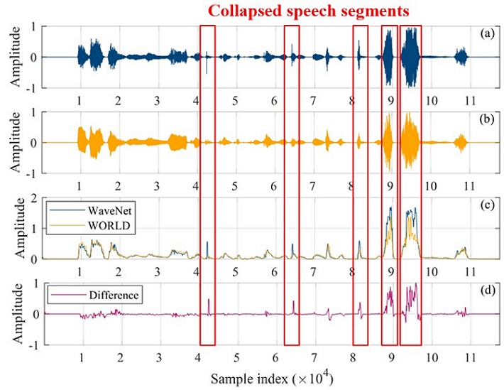
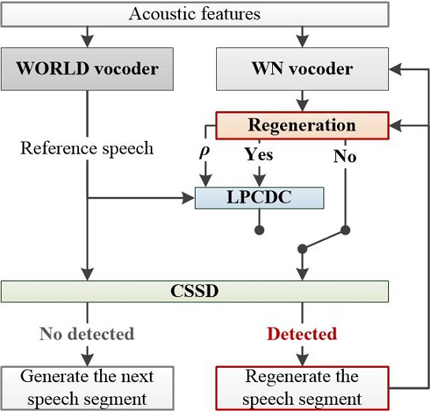

This page is the demo of
1. "Non-parallel voice conversion system with WaveNet vocoder and collapsed speech suppression technique" [paper]   
2. "Collapsed speech segment detection and suppression for WaveNet vocoder" [[paper](https://arxiv.org/abs/1804.11055)] [code]  
3. "The NU non-parallel voice conversion system for the voice conversion challenge 2018" [[paper](https://easychair.org/publications/preprint/mzNP)]  

## **Abstract**  

 We propose a non-parallel voice conversion (VC) system with a WaveNet (WN) vocoder and a collapsed speech suppression technique. The effectiveness of WN as a vocoder to generate high-fidelity speech waveforms on the basis of acoustic features has been confirmed in recent works. However, while combining the WN vocoder with the VC system, the distorted acoustic features, acoustic and temporal mismatches, and exposure bias problems usually lead to significant speech quality degradation especially making WN generate some very noisy speech segments called a collapsed speech. To tackle the problem, we take conventional vocoder generated speech as the reference speech to derive a linear-predictive-coding-distribution-constraint (LPCDC) to prevent WN from the collapsed speech problem. Furthermore, to ease the extra negative effects introduced by LPCDC, we propose a collapsed speech segment detector (CSSD) for only applying the LPCDC to the problematic segments to restrict the quality damage in a very short period. 

Testing corpus: [VCC2018](http://www.vc-challenge.org/)  

## **Collapse speech problem**  
- **Type I**: white-noise-like segment
- **Type II**: short impulse noise

  
Figure (a): WN-generated waveforms w/ the collapsed speech  
Figure (b): WN-generated waveforms w/ LPCDC and CSSD.

## **Collapsed speech segment detection (CSSD)**  
- Waveform envelope extraction

  
- Compared with the reference 

  
Figure (a): WN-generated waveforms w/ the collapsed speech  
Figure (b): WORLD-generated waveforms (reference)  
Figure (c): Detected waveform shapes

## **LPC distribution constraint (LPCDC)**  
- Constrain the WN-predicted PMF with the LPC PMF

 

## **WN vocoder with CSSD and LPCDC**  
- The flowchart of the proposed WN vocoder with the collapsed speech suppression

 

## **Speaker voice conversion (Non-parallel)**
- **Intra** gender conversion

| Vocoder       | Female (SF4->TF1)                                                                                   | Male (SM3->TM1)                                                                                     |
|:--------------|:---------------------------------------------------------------------------------------------------:|:---------------------------------------------------------------------------------------------------:|
| **Source**    | <audio src="res/audio/Natural/SF4/30005.wav" controls preload></audio>                              | <audio src="res/audio/Natural/SM3/30033.wav" controls preload></audio>                              |
| **Target**    | <audio src="res/audio/Natural/TF1/30005.wav" controls preload></audio>                              | <audio src="res/audio/Natural/TM1/30033.wav" controls preload></audio>                              |
| Target + WN   | <audio src="res/audio/WaveNet/TF1/30005.wav" controls preload></audio>                              | <audio src="res/audio/WaveNet/TM1/30033.wav" controls preload></audio>                              |
|               |                                          **Collapsed-free**                                         |                                          **Collapsed-free**                                         |
| DNN + WN      | <audio src="res/audio/CollapsedFree/VCC2SF4-VCC2TF1/DNN+WN/30023.wav" controls preload></audio>     | <audio src="res/audio/CollapsedFree/VCC2SM3-VCC2TM1/DNN+WN/30021.wav" controls preload></audio>     |
| DMDN + WN     | <audio src="res/audio/CollapsedFree/VCC2SF4-VCC2TF1/DMDN+WN/30023.wav" controls preload></audio>    | <audio src="res/audio/CollapsedFree/VCC2SM3-VCC2TM1/DMDN+WN/30021.wav" controls preload></audio>    |
| DMDN + WD     | <audio src="res/audio/CollapsedFree/VCC2SF4-VCC2TF1/DMDN+WD/30023.wav" controls preload></audio>    | <audio src="res/audio/CollapsedFree/VCC2SM3-VCC2TM1/DMDN+WD/30021.wav" controls preload></audio>    |
| DMDN + LPCDC  | <audio src="res/audio/CollapsedFree/VCC2SF4-VCC2TF1/DMDN+LPCDC/30023.wav" controls preload></audio> | <audio src="res/audio/CollapsedFree/VCC2SM3-VCC2TM1/DMDN+LPCDC/30021.wav" controls preload></audio> |
|               |                                            **Collapsed**                                            |                                            **Collapsed**                                            |
| DNN + WN      | <audio src="res/audio/Collapsed/VCC2SF4-VCC2TF1/DNN+WN/30005.wav" controls preload></audio>         | <audio src="res/audio/Collapsed/VCC2SM3-VCC2TM1/DNN+WN/30033.wav" controls preload></audio>         |
| DMDN + WN     | <audio src="res/audio/Collapsed/VCC2SF4-VCC2TF1/DMDN+WN/30005.wav" controls preload></audio>        | <audio src="res/audio/Collapsed/VCC2SM3-VCC2TM1/DMDN+WN/30033.wav" controls preload></audio>        |
| DMDN + WD     | <audio src="res/audio/Collapsed/VCC2SF4-VCC2TF1/DMDN+WD/30005.wav" controls preload></audio>        | <audio src="res/audio/Collapsed/VCC2SM3-VCC2TM1/DMDN+WD/30033.wav" controls preload></audio>        |
| DMDN + LPCDC  | <audio src="res/audio/Collapsed/VCC2SF4-VCC2TF1/DMDN+LPCDC/30005.wav" controls preload></audio>     | <audio src="res/audio/Collapsed/VCC2SM3-VCC2TM1/DMDN+LPCDC/30033.wav" controls preload></audio>     |
| Proposed      | <audio src="res/audio/Collapsed/VCC2SF4-VCC2TF1/Proposed/30005.wav" controls preload></audio>       | <audio src="res/audio/Collapsed/VCC2SM3-VCC2TM1/Proposed/30033.wav" controls preload></audio>       |

   
- **Inter** gender conversion

| Vocoder       | Female (SF3->TM2)                                                                                   | Male (SM4->TF2)                                                                                     |
|:--------------|:---------------------------------------------------------------------------------------------------:|:---------------------------------------------------------------------------------------------------:|
| **Source**    | <audio src="res/audio/Natural/SF3/30017.wav" controls preload></audio>                              | <audio src="res/audio/Natural/SM4/30019.wav" controls preload></audio>                              |
| **Target**    | <audio src="res/audio/Natural/TM2/30017.wav" controls preload></audio>                              | <audio src="res/audio/Natural/TF2/30019.wav" controls preload></audio>                              |
| Target + WN   | <audio src="res/audio/WaveNet/TM2/30017.wav" controls preload></audio>                              | <audio src="res/audio/WaveNet/TF2/30019.wav" controls preload></audio>                              |
|               |                                          **Collapsed-free**                                         |                                          **Collapsed-free**                                         |
| DNN + WN      | <audio src="res/audio/CollapsedFree/VCC2SF3-VCC2TM2/DNN+WN/30003.wav" controls preload></audio>     | <audio src="res/audio/CollapsedFree/VCC2SM4-VCC2TF2/DNN+WN/30019.wav" controls preload></audio>     |
| DMDN + WN     | <audio src="res/audio/CollapsedFree/VCC2SF3-VCC2TM2/DMDN+WN/30003.wav" controls preload></audio>    | <audio src="res/audio/CollapsedFree/VCC2SM4-VCC2TF2/DMDN+WN/30019.wav" controls preload></audio>    |
| DMDN + WD     | <audio src="res/audio/CollapsedFree/VCC2SF3-VCC2TM2/DMDN+WD/30003.wav" controls preload></audio>    | <audio src="res/audio/CollapsedFree/VCC2SM4-VCC2TF2/DMDN+WD/30019.wav" controls preload></audio>    |
| DMDN + LPCDC  | <audio src="res/audio/CollapsedFree/VCC2SF3-VCC2TM2/DMDN+LPCDC/30003.wav" controls preload></audio> | <audio src="res/audio/CollapsedFree/VCC2SM4-VCC2TF2/DMDN+LPCDC/30019.wav" controls preload></audio> |
|               |                                            **Collapsed**                                            |                                            **Collapsed**                                            |
| DNN + WN      | <audio src="res/audio/Collapsed/VCC2SF3-VCC2TM2/DNN+WN/30017.wav" controls preload></audio>         | <audio src="res/audio/Collapsed/VCC2SM4-VCC2TF2/DNN+WN/30005.wav" controls preload></audio>         |
| DMDN + WN     | <audio src="res/audio/Collapsed/VCC2SF3-VCC2TM2/DMDN+WN/30017.wav" controls preload></audio>        | <audio src="res/audio/Collapsed/VCC2SM4-VCC2TF2/DMDN+WN/30005.wav" controls preload></audio>        |
| DMDN + WD     | <audio src="res/audio/Collapsed/VCC2SF3-VCC2TM2/DMDN+WD/30017.wav" controls preload></audio>        | <audio src="res/audio/Collapsed/VCC2SM4-VCC2TF2/DMDN+WD/30005.wav" controls preload></audio>        |
| DMDN + LPCDC  | <audio src="res/audio/Collapsed/VCC2SF3-VCC2TM2/DMDN+LPCDC/30017.wav" controls preload></audio>     | <audio src="res/audio/Collapsed/VCC2SM4-VCC2TF2/DMDN+LPCDC/30005.wav" controls preload></audio>     |
| Proposed      | <audio src="res/audio/Collapsed/VCC2SF3-VCC2TM2/Proposed/30017.wav" controls preload></audio>       | <audio src="res/audio/Collapsed/VCC2SM4-VCC2TF2/Proposed/30005.wav" controls preload></audio>       |
   
   
- Subjective results I: **MOS**

  
   
- Subjective results II: **Similarity**

  
[Home](https://bigpon.github.io/)

   
   